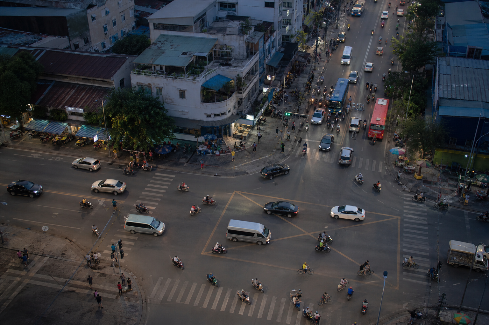
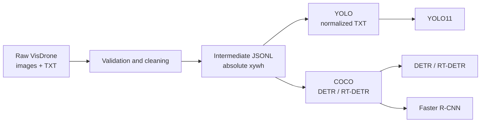

# Object Detection on VisDrone

This project investigates object detection in UAV imagery using the
[VisDrone2019-DET](https://github.com/VisDrone/VisDrone-Dataset) dataset. The repository includes a data
validation and cleaning pipeline, label conversion to YOLO/COCO formats, training notebooks for multiple
model families, evaluation on `test-dev`, and a Streamlit application for testing a local YOLO checkpoint.



## Key Features

- Clean VisDrone annotations without modifying the original data.
- Use a unified intermediate JSONL format before converting to YOLO or COCO/DETR.
- Experiment with Faster R-CNN, YOLO11, DETR, and RT-DETR.
- Support sliced/tiled inference with SAHI or GOIS for small objects.
- Evaluate with COCOeval and a Python port of the official VisDrone toolkit.
- Run YOLO11m + SAHI sliced inference in a Streamlit demo using `models/yolo/best.pt`.

## Processing Pipeline



During preprocessing:

- Rows with `score <= 0` are removed because they represent ignored regions.
- Only VisDrone categories `1` through `10` are retained; internal IDs are remapped to `0` through `9`.
- Non-positive bounding boxes, boxes outside the image, and boxes smaller than the configured threshold
  are removed.
- Bounding boxes that partially cross image boundaries are clipped to the image bounds.
- Unreadable images, images without annotations, and annotations without images are recorded in the
  report.

## Object Classes

| Internal ID | VisDrone ID | Class |
|---:|---:|---|
| 0 | 1 | `pedestrian` |
| 1 | 2 | `people` |
| 2 | 3 | `bicycle` |
| 3 | 4 | `car` |
| 4 | 5 | `van` |
| 5 | 6 | `truck` |
| 6 | 7 | `tricycle` |
| 7 | 8 | `awning-tricycle` |
| 8 | 9 | `bus` |
| 9 | 10 | `motor` |

Category `0` (ignored regions), category `11` (others), and rows with `score = 0` are not used for
training.

## Repository Structure

```text
.
├── data/
│   ├── clone_data.py                  # Download data from Kaggle
│   ├── VisDrone.yaml                  # Ultralytics reference YAML
│   ├── eda_visdrone*.ipynb            # Basic and in-depth EDA
│   ├── augmentation_demo.ipynb        # Augmentation demo/audit
│   └── compare_duplicate_annotations.ipynb
├── src/
│   ├── visdrone_data.py               # Read, validate, clean, and scan data
│   ├── preprocess_visdrone.py          # CLI for creating the intermediate dataset
│   ├── convert_visdrone_to_yolo.py     # JSONL -> YOLO
│   ├── convert_visdrone_to_detr.py     # JSONL -> COCO
│   └── check_duplicate_images.py       # Detect duplicate images by pixel content
├── nb/
│   ├── CNN/                            # Faster R-CNN F0-F5 experiments
│   ├── Transformer/                    # Offline preparation and RT-DETR training
│   └── YOLO11/                         # YOLO11 and SAHI training/evaluation
├── web/
│   ├── app.py                          # Streamlit interface
│   ├── inference.py                    # Model loading, prediction, and bbox rendering
│   ├── styles.css
│   └── assets/visdrone_sample.png
├── test/                               # Unit/integration tests
└── requirements.txt
```

## Environment Requirements

- Python 3.11 is recommended; the source code requires at least Python 3.10.
- Sufficient RAM and disk space for VisDrone. The dataset and development artifacts currently occupy
  several GB.
- A CUDA GPU is recommended for full training and evaluation. Preprocessing and the web demo can still
  run on CPU, but inference will be slower.
- Git and Jupyter are required to run the notebooks.
- A Kaggle account/API token is required when downloading with `data/clone_data.py`.

Create an environment on Windows PowerShell:

```powershell
git clone https://github.com/Nhattk19/Object_dectection.git
cd Object_dectection

py -3.11 -m venv .venv
.\.venv\Scripts\Activate.ps1
python -m pip install --upgrade pip
python -m pip install -r requirements.txt
```

On Linux/macOS:

```bash
python3.11 -m venv .venv
source .venv/bin/activate
python -m pip install --upgrade pip
python -m pip install -r requirements.txt
```

Some optional tasks require additional packages:

```bash
# Run tests
python -m pip install pytest

# Download through the Kaggle API
python -m pip install kaggle

# Run COCO evaluation/SAHI if they are not already installed
python -m pip install "pycocotools>=2.0.7" sahi tqdm
```

> PyTorch must use the correct CPU/CUDA build for your system. If `pip install -r requirements.txt` does
> not select the right build, install `torch` and `torchvision` according to the PyTorch instructions
> before installing the remaining dependencies.

## Data Preparation

### Option 1: Download from Kaggle

Configure your Kaggle API credentials, then run the script **from the `data/` directory** because it saves
the dataset into the current working directory:

```powershell
Push-Location data
python clone_data.py
Pop-Location
```

The script downloads the `kushagrapandya/visdrone-dataset` dataset.

### Option 2: Download Manually

Place the splits under `data/`. The pipeline can also detect archives that create an additional nested
directory with the same name, for example:

```text
data/
├── VisDrone2019-DET-train/
│   └── VisDrone2019-DET-train/
│       ├── images/
│       └── annotations/
├── VisDrone2019-DET-val/
│   └── VisDrone2019-DET-val/
│       ├── images/
│       └── annotations/
└── VisDrone2019-DET-test-dev/
    └── VisDrone2019-DET-test-dev/
        ├── images/
        └── annotations/
```

`test-challenge` has no public ground truth, so it is not suitable for the label conversion pipeline when
its annotation directory is empty.

## Preprocessing

Start with a dry run that writes no files:

```powershell
python src/preprocess_visdrone.py --dry-run
```

Create the default intermediate dataset:

```powershell
python src/preprocess_visdrone.py
```

By default, the command processes `train`, `val`, and `test-dev`, reads from `data/`, and writes to
`data/processed/VisDrone/`. Images are hard-linked to save disk space. If the system does not support hard
links, the script automatically falls back to copying.

Customized example:

```powershell
python src/preprocess_visdrone.py `
  --data-root data `
  --output-root data/processed/VisDrone `
  --splits train val test-dev `
  --min-box-width 2 `
  --min-box-height 2 `
  --image-mode copy
```

Intermediate output:

```text
data/processed/VisDrone/
├── annotations/
│   ├── train.jsonl
│   ├── val.jsonl
│   └── test-dev.jsonl
├── images/
│   ├── train/
│   ├── val/
│   └── test-dev/
├── dataset_manifest.json
└── preprocessing_report.json
```

Each JSONL line represents one image, its dimensions, and a list of objects with absolute `xywh` bounding
boxes. The preprocessing report currently available on the development machine contains the following
statistics:

| Split | Images | Raw annotation rows | Retained objects | Ignored regions | Annotation/image errors |
|---|---:|---:|---:|---:|---:|
| train | 6,471 | 353,550 | 343,204 | 10,345 | 1 non-positive bbox |
| val | 548 | 40,169 | 38,759 | 1,410 | 0 |
| test-dev | 1,610 | 77,547 | 75,102 | 2,445 | 0 |

## Format Conversion

### YOLO

```powershell
python src/convert_visdrone_to_yolo.py
```

The default output is written to `data/formatted/yolo/VisDrone/`:

```text
VisDrone/
├── images/{train,val,test-dev}/
├── labels/{train,val,test-dev}/
└── visdrone_yolo.yaml
```

YOLO labels use the following format:

```text
class_id x_center y_center width height
```

All four coordinates are normalized to `[0, 1]`.

### COCO for DETR/RT-DETR

```powershell
python src/convert_visdrone_to_detr.py
```

The default output is written to `data/formatted/detr/VisDrone/`. Split names are mapped as follows:

| VisDrone | COCO directory |
|---|---|
| `train` | `train` |
| `val` | `valid` |
| `test-dev` | `test` |
| `test-challenge` | `test-challenge` |

Each split directory contains images and an `_annotations.coco.json` file. The root-level
`dataset_info.json` stores dataset metadata.

### Finding Duplicate Images

```powershell
python src/check_duplicate_images.py
```

The script decodes each image to RGB and calculates a SHA-256 hash from its dimensions and pixels. It can
therefore detect identical images even when their filenames or lossless encodings differ. The default
outputs are:

- `data/duplicate_check/duplicate_images.csv`
- `data/duplicate_check/duplicate_images_preview.png`

Example with more workers or a larger preview limit:

```powershell
python src/check_duplicate_images.py --workers 8 --max-preview-groups 10
```

## EDA and Augmentation

Launch Jupyter from the project root:

```powershell
python -m jupyter lab
```

Data notebooks:

- `data/eda_visdrone.ipynb`: data integrity, image dimensions, class imbalance, small bounding boxes,
  density, truncation, and occlusion.
- `data/eda_visdrone_detailed.ipynb`: in-depth EDA covering distribution shifts between splits, spatial
  bias, image quality, class co-occurrence, duplicate/split leakage, tiling simulation, and anchor
  coverage.
- `data/compare_duplicate_annotations.ipynb`: compares annotations for duplicate image pairs.
- `data/augmentation_demo.ipynb`: visualizes and audits augmentation, including experimental rare-class
  copy-paste.

## Training

### YOLO11

- `nb/YOLO11/visdrone-yolo11m.ipynb`: evaluates the base YOLO11m model, fine-tunes it for 50 epochs at
  `imgsz=1280`, and evaluates the best checkpoint with `max_det=500`.
- `nb/YOLO11/visdrone-yolo11m-sahi.ipynb`: slices train/val images into `640x640` tiles with `20%`
  overlap, trains YOLO11m for 15 epochs on the tiles, and evaluates with SAHI on the original images.
- `nb/YOLO11/visdrone-coco-evaluation.ipynb`: exports predictions, builds COCO ground truth, and computes
  overall and per-class metrics on `test-dev`.
- `nb/YOLO11/yolo11s-yolo11m-onl-wheels.ipynb`: prepares weights and wheels for an offline Kaggle
  environment.

YOLO can also be trained directly through its CLI after creating the YOLO dataset:

```powershell
yolo detect train `
  model=yolo11m.pt `
  data=data/formatted/yolo/VisDrone/visdrone_yolo.yaml `
  epochs=50 imgsz=1280 max_det=500
```

### DETR and RT-DETR

- The Hugging Face DETR checkpoint uses ResNet-50, 300 object queries, and 10 VisDrone classes.
- `nb/Transformer/rtdetr_onprepare_1.ipynb` prepares offline assets from
  `PekingU/rtdetr_r50vd_coco_o365`.
- `nb/Transformer/rtdetr_off_training_1.ipynb` trains RT-DETR from the offline assets; the current
  notebook configuration uses 20 epochs and seed 42.

### Faster R-CNN

The notebooks from `nb/CNN/f0-object-cnn.ipynb` through `f5-object-cnn.ipynb` describe the following
experiment sequence:

| Experiment | Main idea |
|---|---|
| F0 | Faster R-CNN ResNet-50-FPN baseline |
| F1 | Add augmentation |
| F2 | Tune anchors for small objects |
| F3 | Tune proposals |
| F4 | F3 proposals + Faster R-CNN V2 |
| F5 | F4 + increased input resolution |

The CNN notebooks clone the `cnn-faster-rcnn-pipeline` branch and require `src/faster_rcnn.py`,
`src/augmentation.py`, and `scripts/train_faster_rcnn.py` from that branch. These files are not available
on the current `main` branch, so either follow the branch-cloning procedure already included in the
notebooks or check out the corresponding branch.

## Running the Web Application

The application uses the fine-tuned YOLO11m SAHI checkpoint at the following fixed path:

```text
models/yolo/best.pt
```

Launch it from the project root:

```powershell
python -m streamlit run web/app.py
```

Open `http://localhost:8501`. The interface allows you to:

- Upload a JPG/JPEG/PNG/WEBP image or use the sample image.
- Run overlapping `640x640` SAHI tiles with `20%` overlap plus SAHI's standard full-frame prediction.
- Adjust the confidence threshold, maximum number of bounding boxes, and merge NMS IoU.
- View object counts by class, inference time, and the rendered prediction image.
- Download the result as a PNG file.

By default, the web application uses a confidence threshold of `0.04`, a final detection cap of `500`,
and class-aware SAHI NMS with an IoU threshold of `0.50`. The current local checkpoint has 10 classes,
uses `640x640` training/inference tiles, and is approximately 38.7 MB. The device is selected in the
following order: CUDA, Apple MPS, then CPU.

## Testing

Run the complete test suite:

```powershell
python -m pytest -q
```

The tests cover bounding-box filtering/clipping, YOLO and COCO conversion, split mapping, checkpoint
metadata, detection rendering, class summaries, and NMS. The latest test result on Python 3.11 is:

```text
11 passed
```

On a fresh clone without a checkpoint, run only the data pipeline tests:

```powershell
python -m pytest test/test_visdrone_data.py -q
```

One test in `test/test_web_inference.py` reads `models/yolo/best.pt` directly, so the checkpoint must be
placed at that location before running the complete suite.

## Reproducibility Notes

- Always run the CLI commands from the project root so that the default paths resolve correctly.
- Prefer `hardlink` when the source data and output are on the same drive to avoid duplicating several GB
  of images.
- The Kaggle notebooks contain `/kaggle/...` paths and some dataset/checkpoint-specific paths. Review the
  configuration variables at the beginning of each notebook before running it.
- Metrics are meaningful only when reported together with their protocol, confidence threshold, NMS,
  tiling settings, and corresponding `maxDets` value.
- The VisDrone dataset and pretrained checkpoints are governed by the licenses/terms of their respective
  providers.
