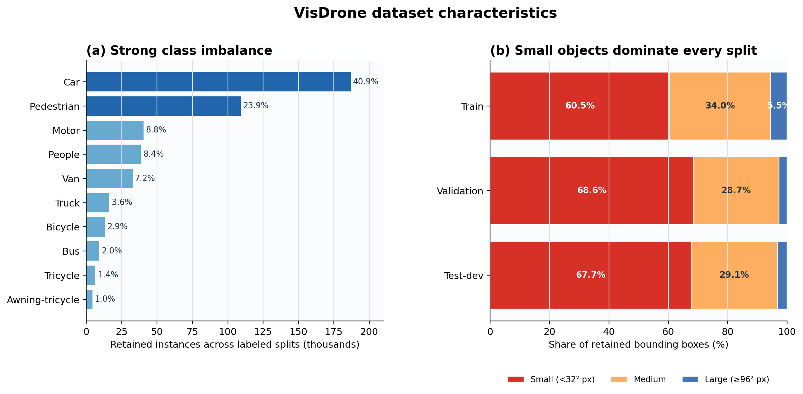
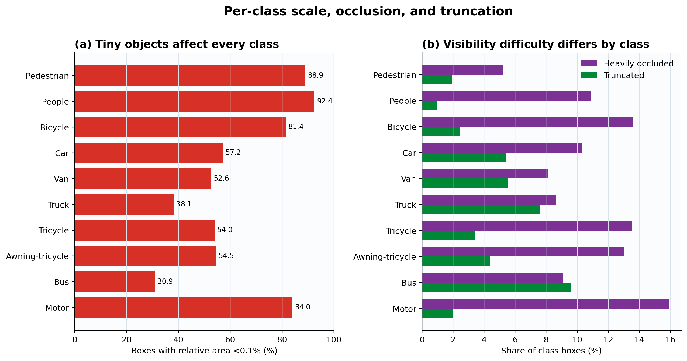
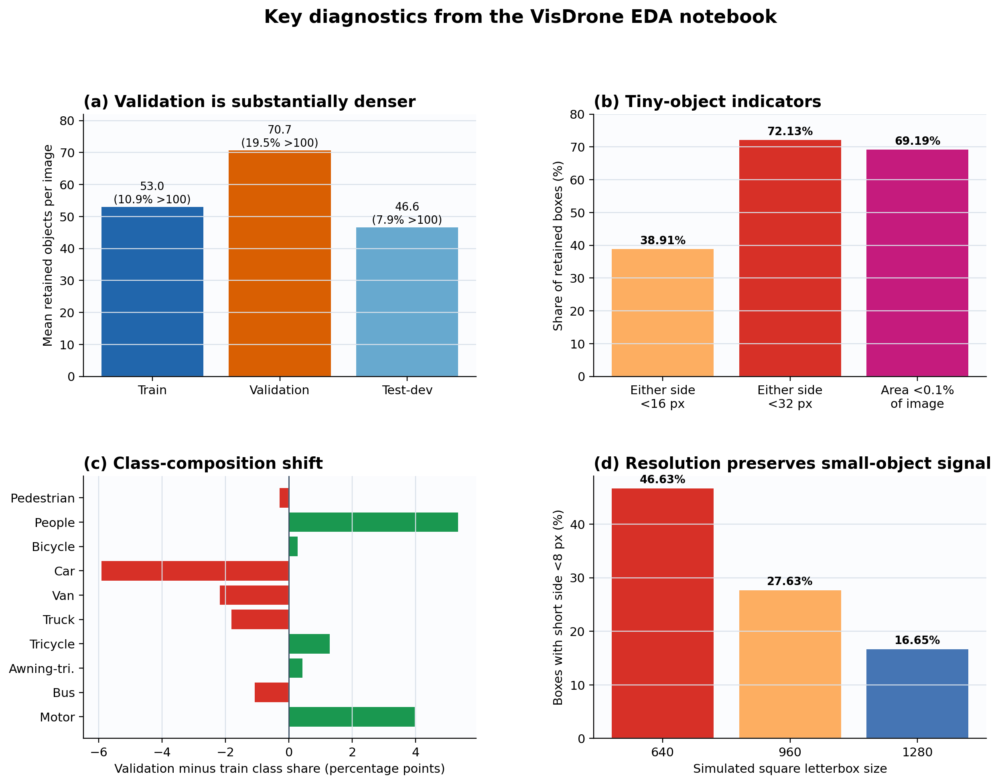
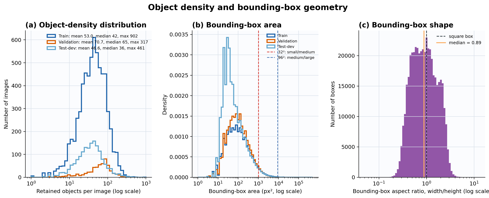
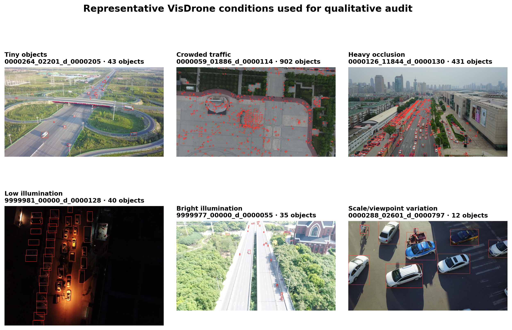
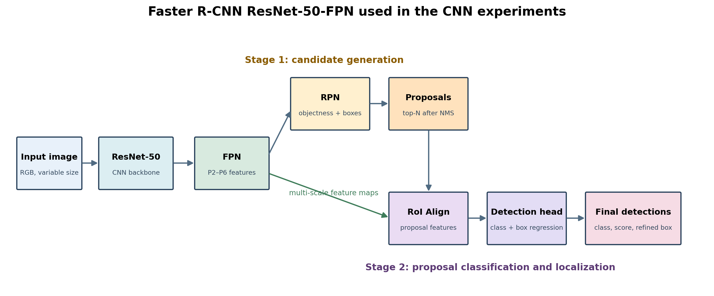
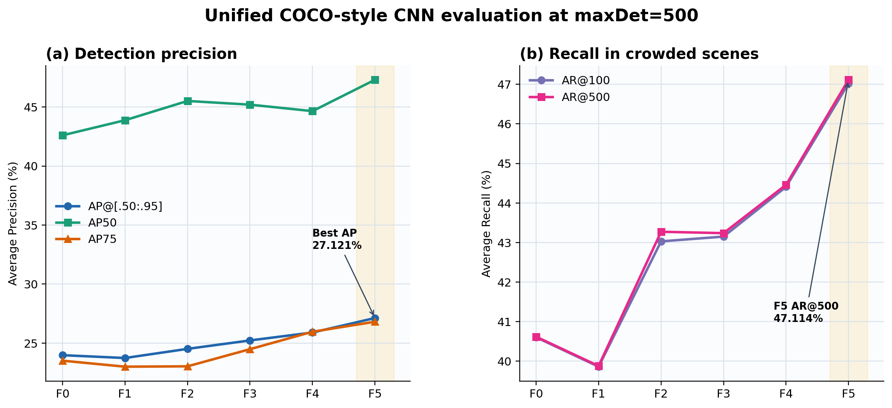
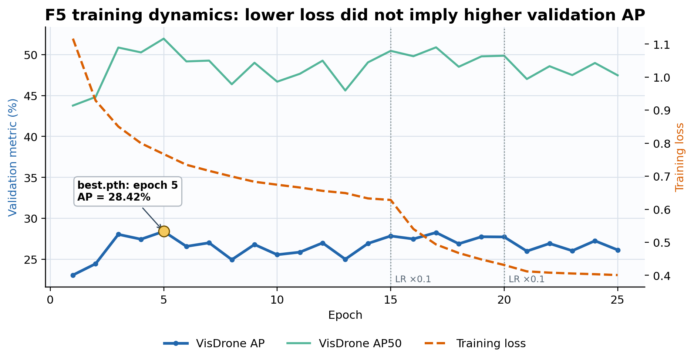

# Dataset Analysis and CNN-Based Object Detection

This document contains the English report sections assigned to the dataset and
CNN-based model work packages. All dataset statistics were computed from the
processed VisDrone files used by the experiments. All reported model results
come from the saved best checkpoints of the full training runs. F0--F5 are
re-evaluated under one COCO-style protocol extended to 500 detections per image.

## 3. Dataset

The project uses the VisDrone2019-DET dataset, a challenging aerial object
detection benchmark collected from drone-mounted cameras in different cities,
weather conditions, altitudes, viewpoints, and scene densities. The detection
task contains ten foreground categories: pedestrian, people, bicycle, car, van,
truck, tricycle, awning-tricycle, bus, and motor. Unlike conventional
street-level datasets, VisDrone contains many small, densely packed, partially
occluded objects. These characteristics strongly influenced the preprocessing,
model configuration, and evaluation protocol used in this project.

### 3.1 Exploratory Data Analysis (EDA)

The exploratory analysis was executed reproducibly in
`data/eda_visdrone_detailed.ipynb` with random seed 42. Dataset and bounding-box
statistics use only annotations marked `status = keep`, exactly matching the
objects exported for training; rejected rows are counted separately for audit.
The image-quality subsection uses a fixed sample of 250 images per split and is
therefore interpreted as a diagnostic rather than a full-population estimate.

#### Dataset scope and integrity

After invalid and ignored annotations were removed, the dataset used in this
project contained 8,629 images and 457,065 valid objects. Table 1 summarizes the
three available splits.

**Table 1. VisDrone2019-DET split statistics after preprocessing.**

| Split | Images | Raw annotation rows | Retained boxes | Mean boxes/image | Median boxes/image | Maximum boxes/image |
|---|---:|---:|---:|---:|---:|---:|
| Train | 6,471 | 353,550 | 343,204 | 53.04 | 42 | 902 |
| Validation | 548 | 40,169 | 38,759 | 70.73 | 65 | 317 |
| Test-dev | 1,610 | 77,547 | 75,102 | 46.65 | 36 | 461 |
| **Total** | **8,629** | **471,266** | **457,065** | — | — | — |

The integrity audit found no missing image–annotation pair, unreadable image,
or malformed annotation row. Of 471,266 raw rows, 457,065 (96.99%) are valid
objects, 14,200 are ignored regions with `score = 0`, and one training box has
non-positive size. No image becomes empty after filtering. The separate
`test-challenge` directory has no public ground truth and is reserved for
submission inference rather than internal evaluation. No retained box required
boundary clipping under the current validation rules.

The dataset is considerably denser than many general-purpose detection
datasets. The training split contains an average of 53 valid objects per image,
and one image contains as many as 902 objects. The validation set is even more
crowded, with 70.73 objects per image on average. Therefore, limiting the number
of Region Proposal Network (RPN) candidates or final detections too aggressively
can remove true positives before classification.

The validation split is also not an easy subset of the training distribution.
Compared with training, it contains more objects per image, a higher percentage
of small objects, and a higher percentage of occluded objects. This difference
helps explain why training loss can continue to decrease while validation AP
stagnates or declines.

#### Class Distribution

Table 2 reports the retained instances across all three labeled splits. The
training-only imbalance was also calculated separately because it directly
affects optimization.

**Table 2. Class distribution across the labeled VisDrone splits.**

| Class | Instances | Share of training boxes |
|---|---:|---:|
| Car | 187,004 | 40.91% |
| Pedestrian | 109,187 | 23.89% |
| Motor | 40,378 | 8.83% |
| People | 38,560 | 8.44% |
| Van | 32,702 | 7.15% |
| Truck | 16,284 | 3.56% |
| Bicycle | 13,069 | 2.86% |
| Bus | 9,117 | 1.99% |
| Tricycle | 6,387 | 1.40% |
| Awning-tricycle | 4,377 | 0.96% |

The distribution is highly imbalanced. Cars and pedestrians account for 64.80%
of all retained instances, whereas awning-tricycles account for 0.96%. Within
the training split, the maximum-to-minimum instance ratio is 44.6:1.
Consequently, the instance-level training loss receives many more updates from
common road-user categories. Although mAP gives equal weight to each category,
one global average still hides which rare classes fail; per-class AP and a
confusion matrix should therefore also be inspected.

#### Object Size Distribution

Object scale is the dominant challenge in this dataset. Using the COCO area
convention—small objects below \(32^2\) pixels, medium objects from \(32^2\) to
\(96^2\) pixels, and large objects at or above \(96^2\) pixels—60.47% of the
training boxes and 68.56% of the validation boxes are small.

**Table 3. Bounding-box scale statistics.**

| Split | Median width | Median height | Median area | Small | Medium | Large |
|---|---:|---:|---:|---:|---:|---:|
| Train | 25 px | 27 px | 680 px² | 60.47% | 34.00% | 5.53% |
| Validation | 20 px | 25 px | 520 px² | 68.56% | 28.68% | 2.76% |
| Test-dev | 20 px | 23 px | 480 px² | 67.66% | 29.13% | 3.21% |



**Figure 1.** Class imbalance and object-scale distribution in the processed
VisDrone dataset. Cars dominate the retained labels, while small boxes account
for more than 60% of every split.

The median training object occupies only 0.046% of its image area. At this
scale, early downsampling can erase discriminative details, and a localization
error of only a few pixels can substantially reduce Intersection over Union
(IoU). Consequently, AP at IoU 0.75 and AP for small objects are especially
important indicators for this project.

The notebook additionally evaluated scale without relying on the COCO area
categories. Across all 457,065 retained boxes, the median geometry is only
24×26 pixels with a median area of 627 pixels². A total of 38.91% of boxes have
at least one side below 16 pixels, 72.13% have at least one side below 32
pixels, and 69.19% occupy less than 0.1% of their image. Tiny objects affect
every category: 92.44% of `people`, 88.88% of `pedestrian`, 83.96% of `motor`,
and 81.38% of `bicycle` instances occupy less than 0.1% of the image. Even the
larger `bus` and `truck` classes contain 30.89% and 38.12% tiny instances.



**Figure 2.** Per-class scale and visibility difficulty. The relative-area
definition of tiny (`area < 0.1% of image`) is an EDA diagnostic and is distinct
from the COCO small-object definition used in Table 3.

#### Image resolution and split differences

VisDrone images are not stored at one fixed resolution. Common sizes include
1,400×1,050, 1,400×788, 2,000×1,500, 1,360×765, 1,916×1,078, and 1,920×1,080.
The pipeline must therefore preserve aspect ratio and support variable-sized
images. Training width ranges from 480 to 2,000 pixels; its mean resolution is
approximately 1,520×1,002. Validation is smaller on average
(1,291×726) and almost entirely uses aspect ratio 1.78, whereas training mixes
approximately 1.33 and 1.78 aspect ratios. Distorting every image to one fixed
width and height would therefore create a split-dependent geometric artifact.

Class composition also shifts between splits. Relative to training, validation
contains 5.34 percentage points more `people` and 3.97 points more `motor`, but
5.92 points fewer `car`. Jensen–Shannon divergence of the class distributions
is small but non-zero (0.0164 for train–validation and 0.0084 for
train–test-dev). The larger shift is object density: the Kolmogorov–Smirnov
distance is 0.253 for train–validation and 0.347 for validation–test-dev.



**Figure 3.** Key diagnostics from the EDA notebook. Validation is both denser
and compositionally different from training. The letterbox simulation also
shows why resolution is important for small-object signal.

#### Objects per Image and Object Density

Occlusion is frequent. Across the labeled data, approximately 49.5% of retained
boxes are unoccluded, 40.9% are partially occluded, and 9.6% are heavily
occluded; approximately 4.0% are truncated. Difficulty is class-dependent:
`motor` has the highest heavy-occlusion rate (15.92%), while `bicycle`,
`tricycle`, and `awning-tricycle` are all near 13%. More than 71% of `people`
and `bicycle` instances are occluded to some degree. `Bus` has the highest
truncation rate (9.63%), followed by `truck` (7.61%). These labels should be
retained during training and used for stratified error analysis.

The validation set contains 70.73 retained objects per image on average,
compared with 53.04 in training and 46.65 in test-dev. Moreover, 19.53% of
validation images and 10.86% of training images contain more than 100 objects;
22 images across the complete labeled dataset contain more than 300 objects.
Dense scenes, occlusion, and small object size create overlapping detections
and make classification, localization, assignment, and non-maximum suppression
more difficult. Figure 4 shows the complete object-count distribution rather
than only its mean: the long right tail confirms that a non-trivial subset of
images is much more crowded than a typical image.

These observations establish four architecture-neutral requirements:

1. preserve and exploit multi-scale features;
2. retain enough proposals, queries, or candidate detections in crowded images;
3. compare models with a shared COCO-style protocol allowing up to 500 final
   detections per image; and
4. treat input resolution as an explicit accuracy--memory experiment.

#### Bounding-box Characteristics

Across all 457,065 retained boxes, median width is 24 pixels, median height is
26 pixels, and median area is only 627 px². The 10th--90th percentile range is
7--81 pixels for width, 10--72 pixels for height, and 90--5,200 px² for area,
showing substantial scale variation and a strong right tail. Bounding-box
aspect ratio, defined as width divided by height, has median 0.89 and spans
0.41--2.08 between the 10th and 90th percentiles. The data therefore contain
portrait-like pedestrians, near-square vehicles, and wide objects; one fixed
box shape cannot represent every category well.



**Figure 4.** Object density and bounding-box geometry. Panel (a) reports the
full objects-per-image distributions together with mean, median, and maximum.
Panel (b) shows the heavily right-skewed box-area distribution and the COCO
small/medium/large boundaries. Panel (c) shows the diversity of box shapes.
Logarithmic horizontal axes retain both tiny/common values and rare extremes.

#### Qualitative Analysis

Quantitative summaries are complemented by a fixed six-image audit gallery.
It contains tiny distant targets, exceptionally crowded traffic, severe
occlusion, low and high illumination, and a visibly different object
scale/viewpoint. Red rectangles show retained ground-truth boxes. The gallery
is intended to expose difficult data conditions and should later be reused to
compare predictions from every model family, including failures rather than
only visually successful cases. VisDrone does not provide per-image altitude
metadata, so the final panel represents apparent scale/viewpoint variation
rather than a verified flight altitude.



**Figure 5.** Qualitative EDA gallery containing small objects, crowded traffic,
heavy occlusion, illumination variation, and scale/viewpoint variation. This is
a dataset audit figure, not a model-prediction result.

#### Spatial context and class co-occurrence

Normalized box centers have median horizontal coordinates between 0.488 and
0.504 for every class, so there is no strong left–right positional bias.
Vertical position is class-dependent: large vehicles tend to appear higher in
the image (median normalized y around 0.34–0.35), whereas people and two-wheel
vehicles tend to appear lower (approximately 0.40–0.46). This pattern reflects
the drone perspective and argues against extreme transformations that destroy
road-scene geometry. Boundary contact is most common for buses (7.01%) and
trucks (5.99%), making bbox-safe translation and cropping essential.

At image level, the strongest class co-occurrences are `car–van` (Jaccard
0.790), `pedestrian–car` (0.771), and `people–motor` (0.718). Such context can
help recognition but may also create shortcuts. Image-level oversampling of a
rare class can unintentionally oversample common co-occurring categories;
targeted instance copy-paste would be more controllable, provided objects are
placed in plausible road contexts.

#### Duplicate, leakage, and image-quality audit

The SHA-256 audit found three exact duplicate groups within individual splits:
two groups in training and one in validation. Their paired annotation files
are not identical, so removing or retaining them requires manual inspection.
No byte-identical image crosses a split. However, filename analysis found 24
sequence prefixes shared by training and validation, and three same-sequence
train–validation pairs have perceptual dHash distance at most six. These are
not proof of direct leakage, but they indicate strong temporal or scene
correlation. The official split should be retained for benchmark comparison,
while a sequence-aware evaluation is recommended when the target is
generalization to unseen scenes.

Image quality was estimated on a fixed sample of 250 images per split.
Validation is brighter on average (0.4518 on a normalized 0–1 scale) than
training (0.3693) and test-dev (0.3447). Mean contrast is similar, while the
validation sharpness proxy is slightly lower. Because this is a sampled
diagnostic rather than a complete quality assessment, it justifies mild
brightness, contrast, color, and blur augmentation but not aggressive
correction of every image.

#### Task-level implications from EDA

The notebook used controlled simulations to translate dataset properties into
testable model hypotheses:

The square-letterbox simulation estimates scale sensitivity across the three
model families. It is a dataset diagnostic rather than the exact runtime
preprocessing of any one detector.

- Under square letterboxing, the share of boxes whose short side falls below 8
  pixels is 46.63% at input 640, 27.63% at 960, and 16.65% at 1,280. Resolution
  must therefore be treated as an accuracy–memory ablation, not a cosmetic
  preprocessing choice.
- At simulated input 960, large default anchor shapes cover substantially fewer
  ground-truth shapes than an 8--128-pixel anchor set at shape-IoU ≥0.5. This is
  an architecture-neutral indication that detectors must preserve fine-scale
  features or otherwise adapt their assignment mechanism to tiny targets; the
  appropriate implementation depends on the model family.
- A 640-pixel tile with 20% overlap geometrically contains 99.81% of boxes in
  at least one tile but costs an estimated 6.59 tile inferences per image.
  Tiling is therefore a general accuracy--latency hypothesis that must be
  validated separately for each detector rather than assumed beneficial.
- Repeat-Factor Sampling with threshold 0.1 assigns a factor of 1.0 to every
  class because even awning-tricycle appears in 17.79% of training images.
  Instance imbalance is therefore not solved by oversampling complete images.

EDA simulations are hypotheses, whereas the trained ablations determine the
final configuration. Overall, the audit identifies tiny objects, crowded
scenes, class imbalance, occlusion, split shift, and sequence correlation as
the principal data risks. It supports aspect-ratio-preserving resize,
high-resolution experiments, increased proposal/detection limits, per-class
and scale-aware metrics, and a fixed qualitative audit set containing crowded,
tiny, blurred, and rare-class examples.

### 3.2 Preprocess

Preprocessing was performed once locally before the processed dataset was
uploaded to Kaggle. The same image splits, class mapping, and COCO ground truth
are shared by the CNN-, YOLO-, and Transformer-based experiments. This prevents
data conversion differences from confounding the comparison among model
families.

Each raw annotation row has the following structure:

```text
x, y, width, height, score, category, truncation, occlusion
```

The preprocessing pipeline performed the following operations:

1. matched each image to the annotation file with the same filename stem;
2. verified that the image could be decoded and converted it conceptually to
   the RGB input format expected at runtime;
3. removed rows with `score <= 0`, which represent ignored regions rather than
   trainable objects;
4. retained only the ten target categories with IDs 1–10; category 0 and the
   `others` category were not used as positive training labels;
5. removed boxes with non-positive width or height or boxes located completely
   outside the image;
6. clipped boundary-crossing boxes to the valid image extent and retained only
   boxes of at least 1×1 pixel after clipping;
7. exported COCO JSON with pixel-space `xywh` boxes, area, category ID, and
   `iscrowd = 0`;
8. exported YOLO labels in parallel for the other model family in the project;
9. hard-linked the original images into the processed directory, with copying
   as a fallback; and
10. generated a preprocessing report for data-integrity verification.

The operation removed 10,345 ignored rows and one non-positive box from the
training set, 1,410 ignored rows from validation, and 2,445 ignored rows from
test-dev. No missing image, missing annotation, unreadable image, or malformed
annotation row was found in the three processed splits.

No image was resized, normalized, or augmented offline. This preserves the
original pixels and avoids storing a separate dataset for each architecture or
experiment. Input sizing, normalization, tensor layout, and label conversion
are performed at runtime by each model family and are therefore documented in
the corresponding experiment setup rather than treated as properties of the
dataset.

Ignored annotations are excluded from the processed training and validation
COCO files but retained in the original VisDrone annotations. The unified
COCO-style comparison in this report uses only the processed ground truth. A
separate official-compatible VisDrone evaluation may additionally use the raw
annotations to suppress detections whose area overlaps an ignored region by at
least 50%; those values are not mixed with the unified results.

### 3.3 Dataset Augmentation

The EDA defines common augmentation requirements for the complete detection
task, independent of whether the downstream model is CNN-, one-stage-, or
Transformer-based. Augmentation is applied only to training samples and online,
so the original images remain unchanged and no augmented copies are stored.
Validation and test images are never stochastically transformed, ensuring that
all model families are compared on the same fixed distribution.

Any geometric operation must transform the image and its bounding boxes with
the same mapping, clip boxes to the image boundary, and remove invalid remnants
without desynchronizing their class labels. Because many VisDrone objects are
only a few pixels wide, aggressive cropping, blur, rotation, or downscaling can
erase the target rather than provide useful invariance. The EDA therefore
supports horizontal flipping, mild affine and photometric perturbations, and
carefully bounded blur as candidate operations. Exact probabilities and
model-specific implementations are controlled within each experiment rather
than imposed as one universal policy. Their exact policies and ablation results
belong in the corresponding experiment sections.

## 4. Experiments

### 4.1 CNN-Based Model

#### 4.1.1 Model Overview

The CNN-based detector is Faster R-CNN with a ResNet-50 backbone and a Feature
Pyramid Network. Faster R-CNN was selected because its two-stage design first
generates class-agnostic candidate regions and then performs proposal-level
classification and box regression. This structure is appropriate for a dataset
with small and overlapping objects, where dense one-stage predictions can be
difficult to separate.

The model contains the following components:

- **ResNet-50 backbone:** extracts hierarchical convolutional features from the
  input image;
- **Feature Pyramid Network:** combines low-resolution semantic features with
  higher-resolution spatial features to represent objects at multiple scales;
- **Region Proposal Network:** predicts objectness and candidate boxes at every
  FPN level;
- **RoI Align and detection head:** converts variable-sized proposals into fixed
  proposal features;
- **classification head:** predicts background or one of the ten VisDrone
  classes; and
- **box-regression head:** refines the proposal coordinates.



**Figure 6.** Faster R-CNN ResNet-50-FPN architecture used by the CNN
experiments. The RPN and detection head share the multi-scale features produced
by the backbone and FPN.

All experiments were initialized from Torchvision COCO pretrained weights. The
original COCO predictor was replaced by a `FastRCNNPredictor` with 11 outputs:
one background class and ten VisDrone foreground classes. F0–F3 used
`fasterrcnn_resnet50_fpn`, whereas F4–F5 used the improved
`fasterrcnn_resnet50_fpn_v2` recipe. Each experiment started independently from
COCO weights; a checkpoint was resumed only when continuing the same interrupted
run.

The training objective is the sum of four losses:

\[
L = L_{\mathrm{cls}} + L_{\mathrm{box}} +
    L_{\mathrm{rpn\_objectness}} + L_{\mathrm{rpn\_box}}.
\]

This objective jointly trains proposal generation, class prediction, and
bounding-box localization.

#### 4.1.2 Set up

Training was performed online in Kaggle on an NVIDIA Tesla T4 GPU with CUDA and
automatic mixed precision. For the CNN pipeline, the data loader converts COCO
boxes from `xywh` to `xyxy` and RGB pixels to `float32` tensors in [0,1]. The
Faster R-CNN transform preserves aspect ratio and applies ImageNet normalization
with mean `(0.485, 0.456, 0.406)` and standard deviation
`(0.229, 0.224, 0.225)`. F0--F4 resize the shorter side to 800 pixels and cap
the longer side at 1,333 pixels; F5 uses 896 and 1,493. Table 4 lists the common
CNN hyperparameters.

**Table 4. Common Faster R-CNN training configuration.**

| Component | Configuration |
|---|---|
| Initialization | Torchvision COCO `DEFAULT` pretrained weights |
| Number of model classes | 11, including background |
| Training duration | 25 epochs |
| Optimizer | SGD |
| Initial learning rate | 0.0025 |
| Momentum | 0.9 |
| Weight decay | 0.0005 |
| Scheduler | MultiStepLR, milestones at epochs 15 and 20, gamma 0.1 |
| Learning-rate schedule | 0.0025 (epochs 1–14), 0.00025 (15–19), 0.000025 (20–25) |
| Random seed | 42 |
| Data-loader workers | 2 |
| Validation batch size | 1 |
| Numerical precision | CUDA automatic mixed precision |
| Hardware | NVIDIA Tesla T4 |

The experiments were organized as a controlled ablation sequence. Apart from
the change named in each row, the previous accepted configuration was preserved.
The physical batch size and accumulation steps were adjusted only to fit GPU
memory; the effective training batch remained two images.

**Table 5. CNN experiment matrix.**

| Run | Detector | Main intervention | Augmentation | Resize (short/long) | Physical batch / accumulation | Best-checkpoint criterion |
|---|---|---|---|---|---|---|
| F0 | Faster R-CNN V1 | baseline, default anchors/proposals | No | 800/1,333 | 2/1 | COCO mAP |
| F1 | Faster R-CNN V1 | F0 + bbox-safe augmentation | Yes | 800/1,333 | 2/1 | COCO mAP |
| F2 | Faster R-CNN V1 | small anchors: 8, 16, 32, 64, 128 px | No | 800/1,333 | 2/1 | COCO mAP |
| F3 | Faster R-CNN V1 | crowded-scene RPN proposal limits | No | 800/1,333 | 2/1 | COCO mAP |
| F4 | Faster R-CNN V2 | F3 + V2 detector recipe | No | 800/1,333 | 1/2 | COCO mAP |
| F5 | Faster R-CNN V2 | F4 + higher input resolution | No | 896/1,493 | 1/2 | VisDrone AP |

F1 evaluated the following CNN-specific online, bounding-box-safe augmentation
policy.

**Table 6. Online augmentation policy evaluated only in CNN experiment F1.**

| Transformation | Probability | Parameters |
|---|---:|---|
| Horizontal flip | 0.50 | left–right flip |
| Vertical flip | 0.20 | top–bottom flip |
| Affine transform | 0.60 | rotation ±10°, translation ±5%, scale 0.90–1.10 |
| Brightness and contrast | 0.80 | independent factors in 0.85–1.15 |
| Gaussian blur | 0.10 | radius 0.10–1.00 |

The training script attaches `ControlledDetectionAugmenter` only when
`EXPERIMENT="F1"`; F0 and F2--F5 use `augmentation=None`. Image and box corners
are transformed together, affine padding uses RGB `(114,114,114)`, and boxes
are clipped after transformation. A box and its class label are removed when a
coordinate is non-finite, width or height is below 2 pixels, or retained area
is below 30% of the expected post-scale area. Seed 42 and deterministic worker
seeding make the stochastic pipeline reproducible. F1 otherwise keeps the
split, initialization, optimizer, schedule, effective batch size, resizing,
anchors, and proposal limits identical to F0 and starts independently from the
same COCO weights.

Under the unified evaluator, F1 raises AP50 by 1.28 points and AP-small by 0.18
but reduces overall AP by 0.24, AP75 by 0.51, AR@100 by 0.74, and AR@500 by
0.74. The policy was not retained in F2--F5. This result belongs to the CNN
ablation and is not a general conclusion that augmentation is harmful to the
other model families.

F2 replaced the five FPN anchor sizes with 8, 16, 32, 64, and 128 pixels and
used aspect ratios 0.5, 1.0, and 2.0 at every level. Relative to F0, it improved
AP by 0.54 points, AP50 by 2.91, AP-small by 1.92, AR-small by 4.88, and AR@500
by 2.65 points, while AP75 decreased by 0.48. Small anchors clearly improved
retrieval of tiny instances, but did not improve high-IoU localization, so the
default anchors were restored for the subsequent proposal ablation.

F3 addressed image density by increasing RPN proposal limits. During training,
the pre-NMS and post-NMS top-N limits were set to 4,000 and 2,000; during
validation, they were 2,000 and 1,000. Compared with F0, F3 improved AP by 1.25
points, AP75 by 0.98, AR@100 by 2.55, and AR@500 by 2.62 points. This change was
retained.

F4 replaced the V1 detector with Faster R-CNN V2 while retaining default
anchors and crowded-scene proposal limits. Compared with F3 under the common
COCO-style evaluator, it improved AP by 0.67 points, AP75 by 1.48, AR@100 by
1.26, AR@500 by 1.22, AP-small by 1.53, and AR-small by 2.22 points. AP50 fell
by 0.55 points, so the gain at stricter IoU is evidence of better localization
rather than merely more low-IoU detections.

F5 increased the shorter input side from 800 to 896 pixels and the long-side
limit from 1,333 to 1,493 pixels. A larger attempted setting of 1,024/1,707
caused out-of-memory failures on the Tesla T4; 896/1,493 was the practical
trade-off between small-object detail and GPU memory. F5 also evaluated up to
500 detections per image at a score threshold of 0.001 and selected its best
checkpoint directly by VisDrone AP.

#### CNN Results and Discussion

The saved best checkpoints from all six full runs were re-evaluated on the
same 548 processed validation images with `pycocotools`. The unified protocol
uses bounding-box IoU thresholds 0.50:0.05:0.95, 101 recall thresholds, and
`maxDets = [1, 10, 100, 500]`. AP, AP50, AP75, and every scale-specific AP/AR
value are computed at 500 detections per image; AR@K uses the stated K. COCO
area ranges define small objects as area below 32² pixels, medium as 32²--96²,
and large as at least 96² pixels. Predictions are retained down to score 0.001
and capped at 500 per image.

This is a **COCO-style evaluation extended to maxDet=500**, rather than the
official COCO maxDet=100 summary or the official VisDrone ignored-region
evaluator. The processed ground truth excludes ignored annotation rows. The
protocol is therefore intended for a controlled comparison across project
models; its values must not be mixed directly with the earlier
official-compatible VisDrone scores.

**Table 7. Unified COCO-style validation results at maxDet=500: overall precision and recall (%).**

| Run | AP (50:95) | AP50 | AP75 | AR@1 | AR@10 | AR@100 | AR@500 |
|---|---:|---:|---:|---:|---:|---:|---:|
| F0 | 23.972 | 42.603 | 23.507 | 10.490 | 30.821 | 40.604 | 40.618 |
| F1 | 23.733 | 43.881 | 22.998 | 10.403 | 30.306 | 39.861 | 39.879 |
| F2 | 24.508 | 45.513 | 23.028 | 10.424 | 30.931 | 43.029 | 43.272 |
| F3 | 25.223 | 45.201 | 24.482 | 10.787 | 31.618 | 43.150 | 43.237 |
| F4 | 25.893 | 44.652 | 25.958 | 10.878 | 32.831 | 44.407 | 44.459 |
| **F5** | **27.121** | **47.308** | **26.806** | **11.300** | **34.411** | **47.024** | **47.114** |

**Table 8. Unified COCO-style validation results at maxDet=500 by object area (%).**

| Run | AP small | AR small | AP medium | AR medium | AP large | AR large |
|---|---:|---:|---:|---:|---:|---:|
| F0 | 15.280 | 31.655 | 34.305 | 52.893 | 42.682 | 58.579 |
| F1 | 15.455 | 30.996 | 33.504 | 52.907 | 44.308 | 61.690 |
| F2 | 17.199 | 36.539 | 33.156 | 51.572 | 42.101 | 57.282 |
| F3 | 16.871 | 35.238 | 35.192 | 53.994 | 43.417 | 57.516 |
| F4 | 18.397 | 37.453 | 35.577 | 53.527 | 43.221 | 55.767 |
| **F5** | **18.954** | **40.025** | **37.783** | **56.683** | **48.531** | **65.439** |



**Figure 7.** Unified COCO-style precision and recall at maxDet=500. F1 shows
that augmentation alone did not improve overall AP, while F2--F5 progressively
improve the baseline and F5 achieves the best value for every reported metric.

F5 is the final CNN model. Relative to F4, it improves AP by 1.228 percentage
points, AP50 by 2.656, AP75 by 0.848, AR@100 by 2.617, and AR@500 by 2.655.
It also gains 0.557 AP-small, 2.206 AP-medium, and 5.310 AP-large. The AP gain
over F4 is 4.74% in relative terms. Against the F0 baseline, F5 gains 3.149 AP
points (13.14% relative), 4.705 AP50, 3.299 AP75, 6.496 AR@500, and 3.674
AP-small points. The run required 9.36 hours for 25 epochs and reached 11.28 GB
peak GPU memory.

The best F5 checkpoint under the training-time VisDrone criterion occurred at
epoch 5, not epoch 25. Training loss decreased from 1.1165 to 0.4009, but that
validation AP fell from its 28.42% maximum to 26.15% at the final epoch. This
gap indicates overfitting or increasing
miscalibration after the early optimum and demonstrates why validation-based
checkpoint selection is necessary. All final inference and comparison should
therefore use `f5/best.pth` from epoch 5.



**Figure 8.** F5 training dynamics. Training loss decreases throughout the run,
whereas validation AP reaches its maximum at epoch 5 and subsequently
fluctuates. This supports validation-based checkpoint selection.

The main remaining limitation is small-object and crowded-scene detection:
F5 AP-small is 18.954%, far below its 37.783% AP-medium and 48.531% AP-large.
Under the separate official-compatible VisDrone protocol, a tiled 640×640
inference experiment slightly increased AR@500 by 0.77 points but reduced AP by
0.88 and AP75 by 1.23 points; it was therefore rejected as the default method.
Future work should prioritize conservative
small-object-aware augmentation, class-aware sampling or loss weighting, and
multi-seed validation rather than adding tiling to the current F5 model.

## References

1. P. Zhu et al., “Vision Meets Drones: A Challenge,” arXiv:1804.07437, 2018.
   <https://arxiv.org/abs/1804.07437>
2. D. Du et al., “VisDrone-DET2019: The Vision Meets Drone Object Detection in
   Image Challenge Results,” ICCV Workshops, 2019.
   <https://openaccess.thecvf.com/content_ICCVW_2019/html/VISDrone/Du_VisDrone-DET2019_The_Vision_Meets_Drone_Object_Detection_in_Image_Challenge_ICCVW_2019_paper.html>
3. S. Ren et al., “Faster R-CNN: Towards Real-Time Object Detection with Region
   Proposal Networks,” NeurIPS, 2015.
   <https://proceedings.neurips.cc/paper_files/paper/2015/hash/14bfa6bb14875e45bba028a21ed38046-Abstract.html>
4. K. He et al., “Deep Residual Learning for Image Recognition,” CVPR, 2016.
   <https://openaccess.thecvf.com/content_cvpr_2016/html/He_Deep_Residual_Learning_CVPR_2016_paper.html>
5. T.-Y. Lin et al., “Feature Pyramid Networks for Object Detection,” CVPR,
   2017. <https://openaccess.thecvf.com/content_cvpr_2017/html/Lin_Feature_Pyramid_Networks_CVPR_2017_paper.html>
6. Torchvision, “Faster R-CNN,” PyTorch documentation.
   <https://docs.pytorch.org/vision/master/models/faster_rcnn.html>
7. VisDrone, “VisDrone2018-DET Toolkit,” GitHub.
   <https://github.com/VisDrone/VisDrone2018-DET-toolkit>
